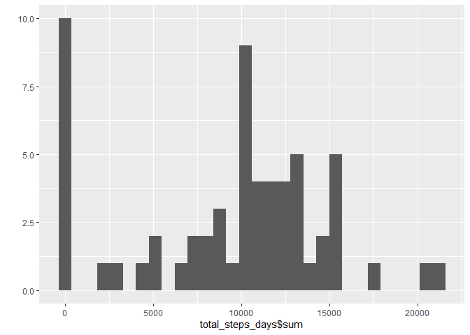
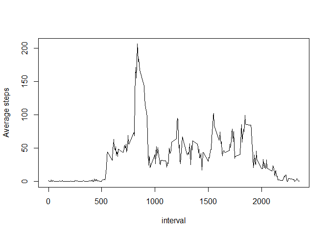
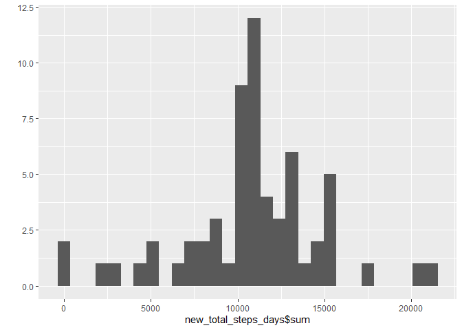
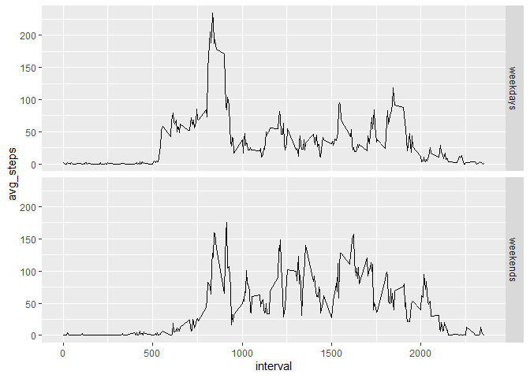

## Loading and preprocessing the data

```r
unzip('activity.zip')
data <- read.csv('activity.csv')
data$date <- as.Date(data$date)
```
## What is mean total number of steps taken per day?


```r
library(dplyr)
```

```
## 
## Attaching package: 'dplyr'
```

```
## The following objects are masked from 'package:stats':
## 
##     filter, lag
```

```
## The following objects are masked from 'package:base':
## 
##     intersect, setdiff, setequal, union
```

```r
library(ggplot2)
total_steps_days <-data %>% group_by(date) %>% summarise(sum = sum(steps,na.rm = T));
```

```
## `summarise()` ungrouping output (override with `.groups` argument)
```

```r
qplot(total_steps_days$sum,geom = 'histogram')
```

```
## `stat_bin()` using `bins = 30`. Pick better value with `binwidth`.
```

<!-- -->


### mean

```r
mean(total_steps_days$sum,na.rm = T)
```

```
## [1] 9354.23
```

### median

```r
median(total_steps_days$sum)
```

```
## [1] 10395
```
## What is the average daily activity pattern?

```r
avg_steps_interval <- data %>% group_by(interval) %>% summarise(avg_steps = mean(steps,na.rm=T));
```

```
## `summarise()` ungrouping output (override with `.groups` argument)
```

```r
plot(x = avg_steps_interval$interval,y= avg_steps_interval$avg_steps,type='l',ylab = 'Average steps',xlab='interval' )
```

<!-- -->

```r
avg_steps_interval[which(avg_steps_interval$avg_steps== max(avg_steps_interval$avg_steps)),'interval']
```

```
## # A tibble: 1 x 1
##   interval
##      <int>
## 1      835
```

## Imputing missing values
i will replace the na values with the mean for it's  interval 

```r
nomis <- sum(is.na(data$steps))
sprintf('number of missing values %s',nomis)
```

```
## [1] "number of missing values 2304"
```

```r
newdata <- data %>% group_by(interval) %>% summarise(avg = mean(steps,na.rm=T),steps,date);
```

```
## `summarise()` regrouping output by 'interval' (override with `.groups` argument)
```

```r
newdata$steps <- ifelse(is.na(newdata$steps),newdata$avg,newdata$steps);
```

```r
new_total_steps_days <-newdata %>% group_by(date) %>% summarise(sum = sum(steps,na.rm = T))
```

```
## `summarise()` ungrouping output (override with `.groups` argument)
```

```r
qplot(x = new_total_steps_days$sum,type='histogram')
```

```
## Warning: Ignoring unknown parameters: type
```

```
## `stat_bin()` using `bins = 30`. Pick better value with `binwidth`.
```

<!-- -->


### Mean

```r
mean(new_total_steps_days$sum)
```

```
## [1] 10766.19
```
### Median

```r
median(new_total_steps_days$sum)
```

```
## [1] 10766.19
```
both mean and median increased
## Are there differences in activity patterns between weekdays and weekends?

```r
weekends<-weekdays(data$date) %in% c('Saturday','Sunday')
data$weekends <- factor(weekends,label=c('weekdays','weekends'))
avg_steps_interval_weekends <- data %>% group_by(interval,weekends) %>% summarise(avg_steps = mean(steps,na.rm=T))
```

```
## `summarise()` regrouping output by 'interval' (override with `.groups` argument)
```

```r
ggplot(data= avg_steps_interval_weekends,aes(x = interval,y=avg_steps))+geom_path()+facet_grid(weekends~.)
```

<!-- -->


